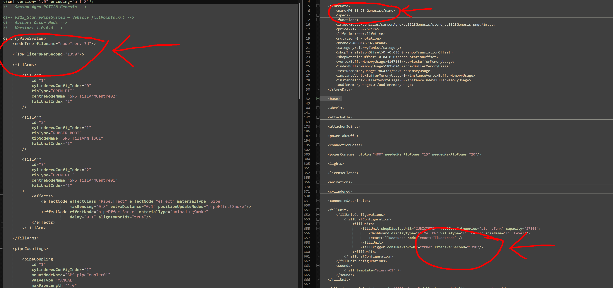

## Fill Arm Setup

Add a new folder into configs/vehicleConfigs. 
##ATTENTION## 
##THIS FOLDER MUST BE NAMED THE EXACT NAME OF THE VEHICLE XML OR IT WILL NOT WORK. 
##YOU CAN ADD A FOLDER IN A FOLDER BUT THE NODETREE AND FILLPOINTS XML MUST BE INSIDE THE FOLDER THAT HAS THE VEHICLE XML NAME.

1. Select the vehicle you are adding SPS to and open the example i3d, the example xml, and the vehicle xml.

2. Import the vehicle into the example i3d. If the vehicle has multiple configurations, 
hide any that are not relevant — in this example the OXBO has both a slurry and manure layout, so the manure configuration is hidden.

3. To set up the fill arm, find the last node in the arm hierarchy that the tip follows. 
On the OXBO this is `loadingArm03` — rotating this node moves the tip, which means SPS must follow this same path.

4. The easiest way to position the SPS fill arm node correctly is to middle-mouse drag and drop it onto `loadingArm03` in the scene tree, 
then zero out all translation and rotation values. This is a critical step — the SPS node must share the exact same name, 
position and rotation as the node it is linked to, otherwise it will not work.

5. Move the now renamed and zero positoned node back from loadingArm03 to fillArmNodes while maintaing the exact position of loadingArm03, then
move the SPS_fillArmTip01 or SPS_fillArmCentre01 to the correct position on tip of the arm. 

6. Then remove the vehicle from the i3d and save as nodeTree.i3d in your newly created folder.

7. Now add in the parts of the fillPoints xml that are relevent for you vehicle (follow other files) and add the fill speed from the veh xml.

